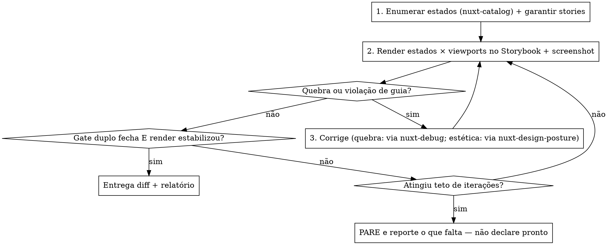

# Nuxt Component Harden

## Overview

Pega **um** componente Vue, renderiza seus estados em **viewports** num sandbox isolado (Storybook), corrige quebras e poli a UX **ancorado nos guias do projeto**, num **loop fechado** que só encerra quando estabiliza.

```text
NENHUMA EDIÇÃO DE DESIGN SEM RENDER ISOLADO E EVIDÊNCIA DE BROWSER
```

Olhar o código não é evidência. Navegar uma página real não é o palco — é acoplamento a rota/auth/dados que o desenho desta skill rejeita de propósito.

## When to Use

- "testa esse componente nas principais telas, conserta o que quebrar e deixa mais agradável".
- Um SFC isolado quebra em alguns breakpoints, ou precisa de um passe de espaçamento/tipografia/hierarquia.
- Quer robustez visual + polimento de UX de um componente sem montar harness à mão.

## When NOT to Use

- Bug pontual já reproduzido numa página real → `nimbou-skills:nuxt-debug`.
- Cobertura E2E de um fluxo/rota → `nimbou-skills:nuxt-test`.
- Revisão ampla read-only de uma feature → `nimbou-skills:nuxt-audit`.
- Decidir fontes/cores/tokens do zero → `nimbou-skills:nuxt-design-posture`.
- Decompor uma feature em componentes → `nimbou-skills:nuxt-think`.

## Pré-condições (pare se faltarem)

1. **Storybook** configurado no projeto-alvo. É o palco canônico de avaliação. Sem Storybook, **pare e reporte** — não troque por navegação de páginas reais.
2. **`DESIGN.md` + `GUIDELINES.md`** resolvidos pela área do componente (mesma ordem da `nimbou-skills:nuxt-audit`: do diretório do componente subindo). São a régua do "agradável". Se faltarem, pare e sugira `/design-md`; só siga com aprovação explícita de usar regras genéricas.
3. Edição autônoma de arquivo real → rode em branch/worktree (`nimbou-skills:using-git-worktrees`) e mostre o diff antes de qualquer commit.

## O loop fechado (núcleo)



Corrige quebra objetiva e poli a estética **autonomamente** dentro do loop. Só as **stories** têm gate de confirmação (artefato persistente). Diff final sempre mostrado antes de commit.

## Superfície de avaliação

**Matriz de estados** (mínimo): `vazio`, `carregando`, `erro`, `preenchido mínimo`, `preenchido no limite` (texto longo, lista grande, número grande). Derive a lista das props/slots reais via `nimbou-skills:nuxt-catalog` — não invente estados nem ignore os obrigatórios.

**Matriz de viewports**: mobile (~390), tablet (~768), desktop (~1280) — use o addon de viewport do Storybook. Acrescente o que o `GUIDELINES.md` exigir.

Avalie **todo estado × todo viewport**. Um esconde o que o outro mostra.

## Stories: gerar o que falta

- Use as stories existentes; para estados sem story, **crie/complete** `*.stories.*` cobrindo a matriz, com args das props reais (via catálogo).
- Stories são artefato persistente: **pergunte antes de commitá-las**. Se o usuário não quiser persistir, use stories efêmeras só durante o ciclo e descarte no fim.
- Stories ruins viciam toda a avaliação seguinte — confira que cada estado renderiza o que diz renderizar antes de julgar.

## Orquestração (quem decide o quê)

- `nimbou-skills:nuxt-catalog` — fonte das props/slots/estados (lê `components.meta.json`). Não reimplemente descoberta.
- `nimbou-skills:nuxt-debug` — quando um estado quebra (erro/warning de console, hydration, overflow não-óbvio): delega o diagnóstico de causa-raiz com evidência de browser. Não chute o fix.
- `nimbou-skills:nuxt-design-posture` — régua das decisões estéticas (tipografia, espaçamento, cor, bans CSS). Esta skill **aplica**; posture **julga**.
- Esta skill é dona do loop, das matrizes, dos gates e da edição do SFC.

## Critério de parada (gate duplo + teto)

Encerra **somente** quando, ao mesmo tempo:

1. **Zero violações** de `DESIGN.md`/`GUIDELINES.md` (incl. Absolute Bans do `nuxt-design-posture`).
2. **Checklist objetivo 100%** (abaixo) em todo estado × viewport.
3. **Render estabilizou**: duas iterações consecutivas sem mudança visual.

**Teto de iterações** (default 3) é trava de segurança: ao atingir o teto sem fechar os gates, **pare e reporte o que falta** — não declare pronto, não fique polindo "mais um pouco". Feche com `nimbou-skills:verification-before-completion`.

### Checklist objetivo

- [ ] Sem overflow/clipping/scroll inesperado
- [ ] Console sem erro/warning (Vue, hydration, prop)
- [ ] Contraste de texto ≥ AA
- [ ] Touch target dos controles ≥ 44px
- [ ] Espaçamentos saem da escala de tokens (sem px mágicos)
- [ ] Fontes/tamanhos saem dos tokens tipográficos
- [ ] Altura/alinhamento estável quando o conteúdo varia (sem "pulo")
- [ ] Estados loading/empty/error/success visíveis e corretos

## Red flags — pare e volte ao loop

| Racionalização | Realidade |
|---|---|
| "Li o código, tá ok" | Código não é render. Sem screenshot do estado, você não viu a quebra. |
| "Naveguei a página real, chega" | Página real é acoplamento a rota/auth/dados. O palco é o Storybook isolado. |
| "Uma rodada de validação basta" | Loop fechado exige re-render e estabilização (2 iterações iguais). |
| "Vou polir mais um pouquinho" | Sem gate, vira gold-plating. Fecha nos gates ou para no teto. |
| "Criei a story e já commitei" | Story é artefato persistente: confirme antes de commitar. |
| "Sem guia eu uso meu gosto" | Sem `GUIDELINES.md`, pare e sugira `/design-md`. Gosto em produção é dívida. |
| "Conserto dentro do componente" (quebra é do pai) | Mascarar quebra estrutural é gambiarra. Reporte a origem real. |
| "Tá com pressa, Storybook é frescura" | Pressa não rebaixa o palco. Sem Storybook, pare e reporte; página real só como override consciente e rotulado pelo usuário. |
| "Pode commitar que eu confio" | Pré-autorização não dispensa gates nem diff. Feche os gates, mostre o diff, confirme as stories — autoridade não colapsa o loop. |

## Quick Reference

| Fase | Foco | Saída |
|---|---|---|
| 1. Estados | catálogo → matriz de estados, garantir stories | stories cobrindo a matriz (gate de commit) |
| 2. Render | Storybook × viewports, screenshot | evidência por estado × viewport |
| 3. Diagnóstico | quebra → `nuxt-debug`; estética → `nuxt-design-posture` | causa-raiz e direção de correção |
| 4. Correção | edita o SFC, re-renderiza, compara | diff + screenshots antes/depois |
| 5. Parada | gate duplo + estabilização, teto como trava | entrega ou relatório do que falta |
